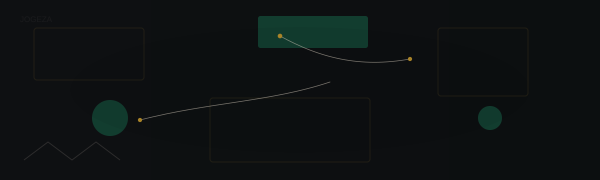

# JOGEZA

**DESIGN × CODE × BUSINESS**

Creative Technologist

I design brands, build web products and work on software that solves real problems. Some days I am focused on visual identity and details of interaction. Other days I am writing Python, shipping a Next.js app or improving the systems behind a product.

---

## Design, engineering and business

### Design

I usually start with the visual side. I care about clarity, layout and how people experience a product. Good visuals make things easier to understand.

### Engineering

Once an idea is clear, I like turning it into something real. Most of my development work is with Next.js, React, TypeScript and Python. I pay attention to tests and automation so things keep working.

### Business

What comes after launch matters. I focus on products that solve a real problem and make sense for customers and for the business that supports them.

---

## Selected work

### 01. JQE

**Quantitative technology**

JQE is a project I build to explore quantitative trading and market research. It collects market data, runs backtests, helps me develop strategies and includes risk checks and execution components. I work with Python, Pandas and NumPy, along with my own backtesting and trading infrastructure.

[View JQE](https://github.com/Jogeza/JQE)

### 02. Continental Love

**Global commerce**

Continental Love is a brand and storefront for African products. The idea is to bring coffee, jewelry and apparel to customers outside Africa while keeping a strong editorial identity. I use Next.js and TypeScript for the storefront and Firebase for backend services.

[View Continental Love](https://github.com/Jogeza/Continental-Love)

### 03. MI-OLSG

**Digital media**

MI-OLSG is a media-first platform for video, livestreams, articles and community. The goal is to make content easy to find and simple for people to engage with. The current stack relies on Next.js and Firebase and focuses on reliable media delivery and discoverability.

### 04. Joki Holdings

**Creative technology**

Joki Holdings combines design, print, web and digital business. I am working on turning those services into repeatable systems and product-like offerings that scale.

---

## Technology

### Design

Figma, Illustrator and Photoshop.

### Development

Next.js, React, TypeScript and Python.

### Data and cloud

Pandas, NumPy, Firebase and PostgreSQL.

### Tools

Git, GitHub and Pytest.

---

## Currently

Right now most of my time goes to JQE and Continental Love. I’m also maintaining MI-OLSG and improving the systems that support Joki Holdings. I’m interested in how AI can speed up parts of design and development without removing the human decisions that matter.

---

## Learning

I am spending time on software architecture, advanced Python, AI-assisted development, automation and quantitative finance.

---

## Philosophy

I like making things people can use. Good design helps people understand what to do. Good engineering makes that experience reliable. When a product has both and a clear business reason, it becomes useful in the real world.

---

## GitHub activity

GitHub activity and statistics are secondary to the work itself, so they are kept simple here.

---

## Interests and open source

Developer tools, AI-assisted workflows, quantitative technology, e-commerce, design systems, automation, African technology.

---

## Contact

[GitHub](https://github.com/Jogeza)

[Profile repository](https://github.com/Jogeza/Jogeza)
